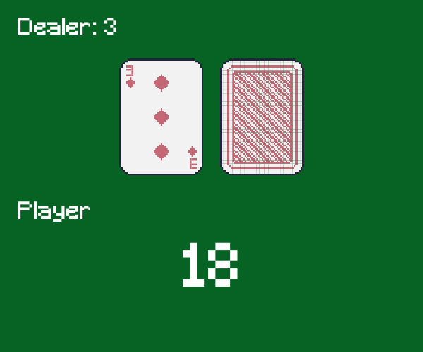

# ♣️ BlackjackGPT

_RL-tune Llama2 to play Blackjack in OpenAI Gym_

<p align="center">
  
	
</p>

<a href='https://huggingface.co/datasets/photonmz/blackjack-gpt'></a>

llms can play rl games better! forget rlhf, what if llama2 can master games w an internal world rep?

let's say **prompt**: "You have cards 7 + 8, you deal. Got card 10, busted."

- _RLHF_ predicts reward w 'reward model' (PPO) or 'preference data' (DPO)
- _RL_ predicts w reward itself! `PURITY 🦢`

reward = -1 if lose else 1.

continues veritable neurips trend to reach agi by [mastering](https://openreview.net/forum?id=yMHzGXgcQeg) [games](http://arxiv.org/abs/1806.11532).

## Setup

```sh
pip install -r requirements.txt
# Open LLM_Gym.ipynb
```

## Contributing

Yes plz help, we guzzle PRs like gutters in the rain.

### TODO:
- [ ] read deeper into PPO (and PPO+LoRA work) to understand the logs and hyperparams
- [ ] try a more deterministic env or text game
- [ ] log action choices
  - [ ] log only after trainstep, not each episode? is this causing slowdown? thread it out maybe? is there a setting that allows logs to accumulate locally and then send at once less regularly?
- [ ] wandb hyperparam sweep
- [ ] refactory and package/framework-ize as Llama-Gym